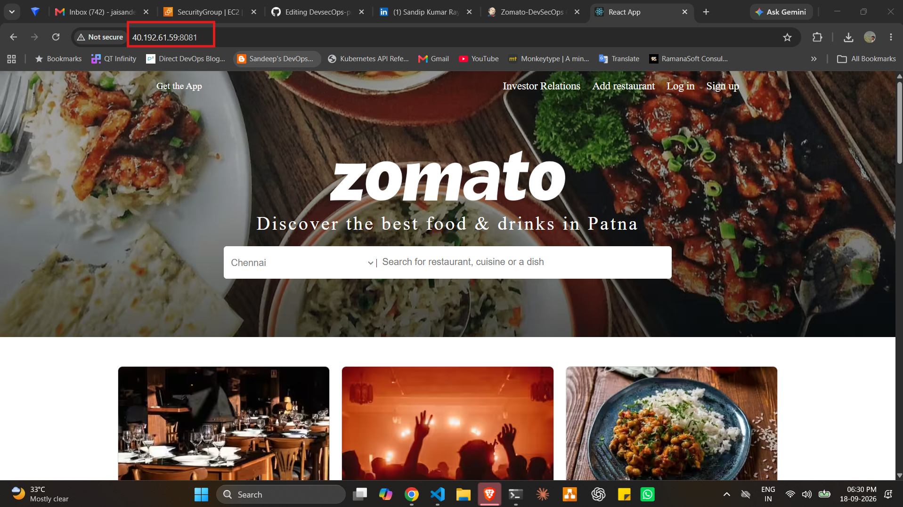
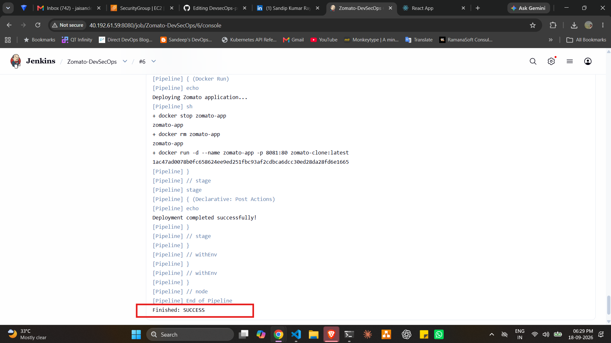
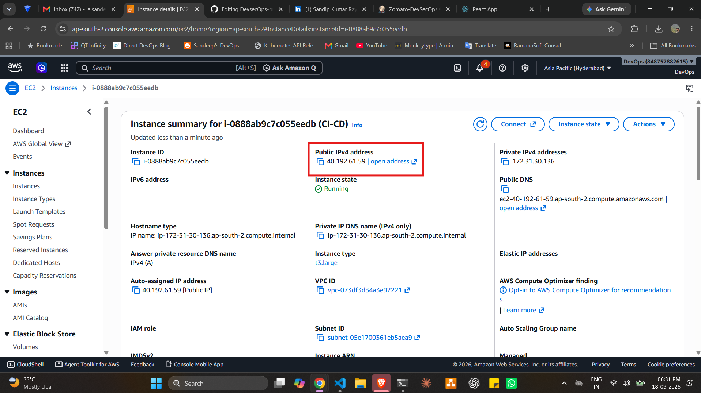

# 🍽️ Zomato Clone – DevSecOps CI/CD Project

A React-based Zomato Clone deployed using a secure and automated DevSecOps pipeline with **Jenkins, Docker, Trivy, and AWS EC2**.

## 📌 Project Overview

This project demonstrates how a frontend application can be containerized, security-scanned, and deployed automatically using CI/CD practices.

The application is built with **React.js** and deployed through a Jenkins pipeline that performs dependency installation, production build, Docker image creation, Trivy security scanning, and container deployment.

## 🚀 Live Deployment

- **Application:** `http://40.192.61.59:8081`
- **Jenkins:** `http://40.192.61.59:8080`
- **Repository:** [DevSecOps Project](https://github.com/Sandeep310/DevsecOps-project)

> Replace `<EC2-PUBLIC-IP>` with your current AWS EC2 public IP address.

## 📸 Project Screenshots

### 🏠 Zomato Clone – Home Page



### ⚙️ Jenkins CI/CD Pipeline – Successful Deployment



### ☁️ AWS EC2 Instance Hosting the Application



## 🛠️ Technologies Used

### Application

- React.js
- JavaScript
- HTML5
- CSS3
- Create React App
- npm

### DevOps and DevSecOps

- Git
- GitHub
- Jenkins
- Docker
- Docker Compose concepts
- Trivy
- AWS EC2
- Linux / Ubuntu
- Nginx

## 🔐 DevSecOps Pipeline

The Jenkins pipeline performs the following stages:

```text
Developer
   |
   v
GitHub Repository
   |
   v
Jenkins Pipeline
   |
   +--> Checkout Source Code
   |
   +--> Install Dependencies
   |
   +--> Build React Application
   |
   +--> Build Docker Image
   |
   +--> Scan Image with Trivy
   |
   +--> Deploy Container on AWS EC2
   |
   v
Running Application
```

## ⚙️ Jenkins Pipeline Stages

| Stage | Description |
|---|---|
| Checkout | Retrieves the latest source code from GitHub |
| Install Dependencies | Installs project dependencies using `npm ci` |
| Build | Creates the production-ready React build |
| Docker Build | Builds the application Docker image |
| Trivy Scan | Scans the Docker image for vulnerabilities |
| Docker Run | Stops the previous container and deploys the latest version |

## 🐳 Docker Configuration

The application uses a multi-stage Dockerfile.

### Build Stage

- Uses Node.js 18 Alpine
- Installs npm dependencies
- Builds the React application

### Production Stage

- Uses Nginx Alpine
- Serves the React production build
- Exposes port `80` inside the container

The application is deployed on EC2 using:

```bash
docker run -d \
  --name zomato-app \
  -p 8081:80 \
  sndeep310/zomato-clone:latest
```

## 🔧 Local Setup

### Prerequisites

Install the following tools:

- Node.js
- npm
- Git
- Docker, if you want to run the application in a container

### Clone the Repository

```bash
git clone https://github.com/Sandeep310/DevsecOps-project.git
cd DevsecOps-project/Zomato-Clone
```

### Install Dependencies

```bash
npm install
```

### Run in Development Mode

```bash
npm start
```

Open the application in your browser:

```text
http://localhost:3000
```

## 🏗️ Create a Production Build

Because of the legacy React build configuration, use:

```bash
NODE_OPTIONS=--openssl-legacy-provider npm run build
```

The production files will be generated inside the `build/` directory.

## 🐳 Run with Docker

### Build the Docker Image

```bash
docker build -t zomato-clone .
```

### Run the Container

```bash
docker run -d \
  --name zomato-app \
  -p 8081:80 \
  zomato-clone
```

Open:

```text
http://localhost:8081
```

### Check Running Containers

```bash
docker ps
```

### View Container Logs

```bash
docker logs zomato-app
```

### Stop the Container

```bash
docker stop zomato-app
```

## 🛡️ Security Scanning with Trivy

The Docker image is scanned using Trivy before deployment.

```bash
trivy image sndeep310/zomato-clone:latest
```

Trivy helps identify vulnerabilities in:

- Operating system packages
- Application dependencies
- Container images

## ☁️ AWS EC2 Deployment

The application is deployed on an Ubuntu-based AWS EC2 instance.

### Deployment Components

- AWS EC2 for cloud hosting
- Jenkins for CI/CD automation
- Docker for containerization
- Nginx for serving the React application
- Trivy for container security scanning

### Required Security Group Ports

| Port | Purpose |
|---|---|
| `22` | SSH access |
| `80` | HTTP |
| `443` | HTTPS |
| `8080` | Jenkins |
| `8081` | Zomato Clone application |
| `9000` | SonarQube, if configured |

## 📂 Project Structure

```text
Zomato-Clone/
│
├── public/
├── src/
├── .dockerignore
├── .gitignore
├── Dockerfile
├── jenkinsfile
├── package.json
├── package-lock.json
└── README.md
```

## 📜 Available npm Scripts

| Command | Description |
|---|---|
| `npm start` | Starts the development server |
| `npm test` | Runs the test runner |
| `npm run build` | Creates the production build |
| `npm run eject` | Ejects Create React App configuration |

## 🎯 Project Objectives

- Implement CI/CD using Jenkins
- Containerize a React application using Docker
- Deploy an application on AWS EC2
- Integrate Trivy container security scanning
- Automate application deployment
- Practice Linux and cloud deployment
- Understand basic DevSecOps workflows

## 📈 Future Improvements

- Add SonarQube code-quality analysis
- Add automated unit testing
- Push Docker images automatically to Docker Hub
- Add Kubernetes deployment
- Add HTTPS using a domain and SSL certificate
- Add monitoring using Prometheus and Grafana
- Add rollback and blue-green deployment strategies

## 👨‍💻 Author

**Jai Sandeep Gudimetla**

B.Tech – Electronics and Communication Engineering  
VIT Vellore

### Skills

- AWS
- Linux
- Docker
- Kubernetes
- Jenkins
- GitHub Actions
- Terraform
- CI/CD
- DevSecOps

## ⭐ Support

If you find this project useful for learning DevOps or DevSecOps, consider giving the repository a star.

